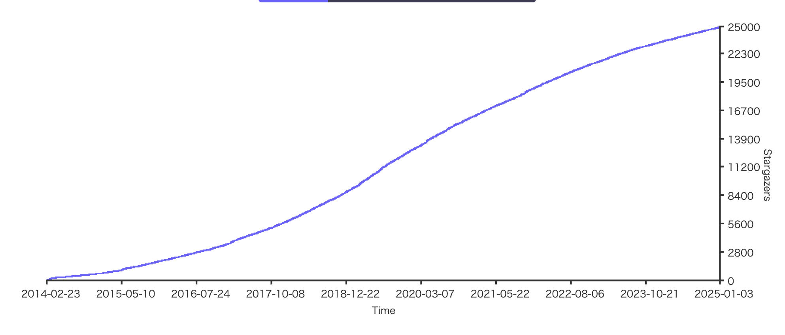
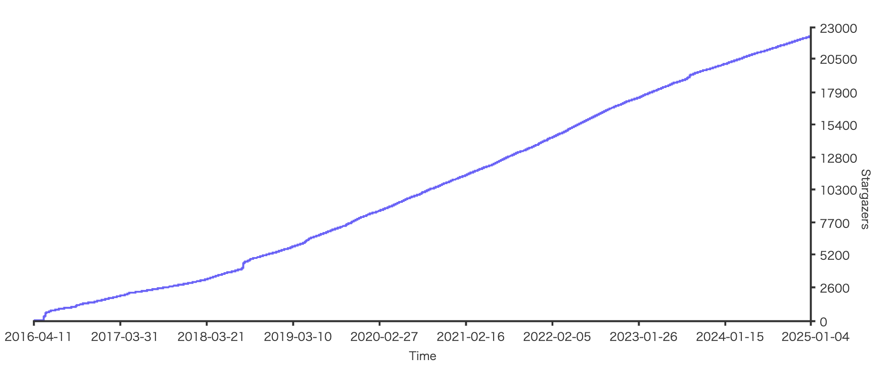
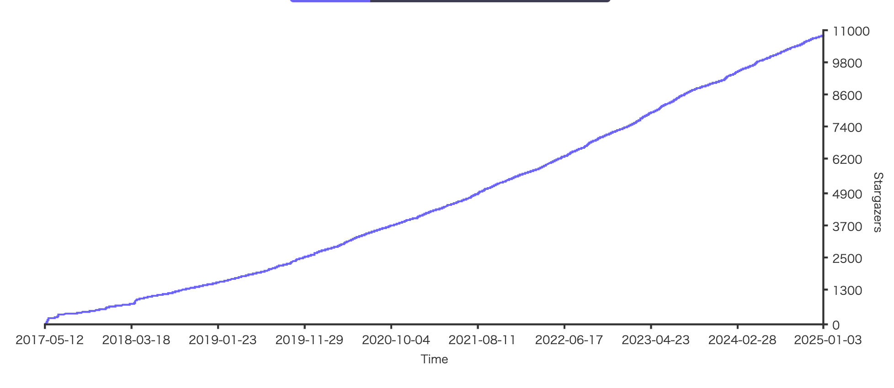
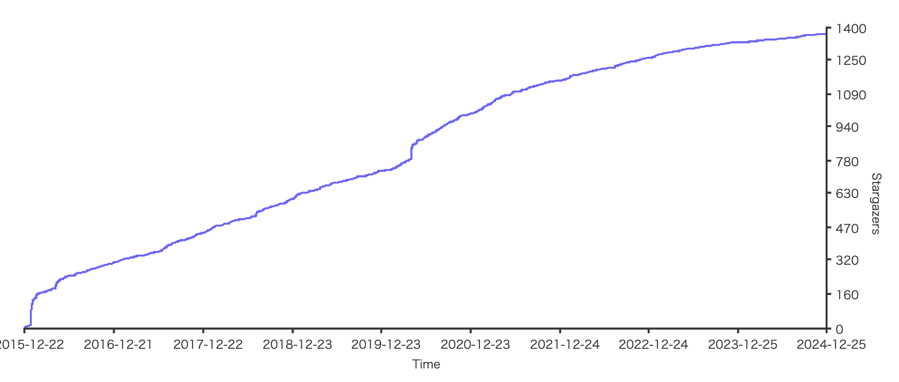

# ロギング

## 調査時期

2025/1/3 now

## 前提

- GitサーバはGitHubのみ。

## 定量的な比較表

`Star`および`Watch`はGitHub上のもの。

| 名称 (リンク)                                                     | 最終 更新日  | Star  | Watch | 最新 Version        | License | 開発元            | ドキュメント                                                                                      |
|------------------------------------------------------------------|------------|-------|-------|----------------------|---------|------------------------------|----------------------------------------------------------------------------------------------------------|
| [Logrus](https://github.com/sirupsen/logrus)                     | 2024-11-18 | 24.9k | 315   | v1.9.3               | MIT     | Simon Eskildsen (個人)       | [pkg.go.dev/github.com/sirupsen/logrus](https://pkg.go.dev/github.com/sirupsen/logrus)                  |
| [Zap](https://github.com/uber-go/zap)                            | 2024-12-11 | 22.3k | 248   | v1.27.0              | MIT     | Uber                        | [pkg.go.dev/go.uber.org/zap](https://pkg.go.dev/go.uber.org/zap)                                        |
| [Zerolog](https://github.com/rs/zerolog)                         | 2024-12-27 | 10.8k | 72    | v1.33.0              | MIT     | rs (個人)                    | [pkg.go.dev/github.com/rs/zerolog](https://pkg.go.dev/github.com/rs/zerolog)                            |
| [Apex/log](https://github.com/apex/log)                          | 2020-08-18 | 1.4k  | 37    | v1.9.0  | MIT     | Apex, TJ Holowaychuk (個人) | [pkg.go.dev/github.com/apex/log](https://pkg.go.dev/github.com/apex/log)                                |
| [go-kit/kit (log)](https://github.com/go-kit/kit/tree/master/log)| 2021-08-19 | 26.7k | 676   | v0.13.0 | MIT     | 個人/コミュニティ            | [pkg.go.dev/github.com/go-kit/kit/log](https://pkg.go.dev/github.com/go-kit/kit/log)                    |

### GitHub Star History

[startchart.cc](https://starchart.cc/)を使用。

#### Logrus

#### Zap

#### Zerolog

#### Apex/log

## 定性的な比較表

| 観点                 | Logrus                                                                                           | Zap                                                                                   | Zerolog                                                                                                    | Apex/log                                                                                  | go-kit/kit(log)                                                                                                   |
|----------------------|------------------------------------------------------------------------------------------------|---------------------------------------------------------------------------------------|-------------------------------------------------------------------------------------------------------------|-------------------------------------------------------------------------------------------|-------------------------------------------------------------------------------------------------------------------|
| **人気度／コミュニティ** | Goにおけるロギングライブラリの中でもトップクラスのStar数を誇り、多くのプロジェクトで採用実績あり | Uberが開発しており企業サポートもある。活発なコミュニティが存在                         | ゼロアロケーション(ほぼヒープ割り当てなし)を志向する実装が注目されており人気                                | シンプルかつプラガブルな設計で人気。拡張がしやすく、フック機能も充実                               | マイクロサービス向けGoフレームワーク「go-kit」の一部として利用可能。コミュニティは着実に成長                       |
| **学習コスト**       | シンプルなAPIのため比較的低い                                                                  | 構造化ログの理解が必要になるため、やや学習コストは高め                                 | ログフォーマットを柔軟に設定する場合は中程度の学習コスト                                                    | API自体はシンプルで、比較的低い                                                         | go-kit全体のアーキテクチャを理解する必要があるためやや高め                                                        |
| **パフォーマンス考慮** | パフォーマンスは一般的な水準で、シンプルなアプリケーションには十分                              | 高パフォーマンスを追求しており、構造化ログが高速                                       | allocation-freeを実現し、高いパフォーマンスを発揮                                                            | やや汎用的ではあるが、ZapやZerologと比べるとパフォーマンス面ではやや劣る                         | 強く意識されてはいないが、マイクロサービス向けにそこそこのパフォーマンスを確保                                    |
| **ユースケース**     | 小〜中規模アプリケーション全般、初学者から中級者まで幅広く利用                                   | 大規模アプリケーションや、パフォーマンスが重要となるシステム                           | 大規模リアルタイムシステムや、パフォーマンスがシビアな環境                                                  | 通常規模のアプリケーションや、ログをカスタマイズしたい場合                                           | マイクロサービス構築時に、go-kitと併用して使いたい場合に最適                                                       |

