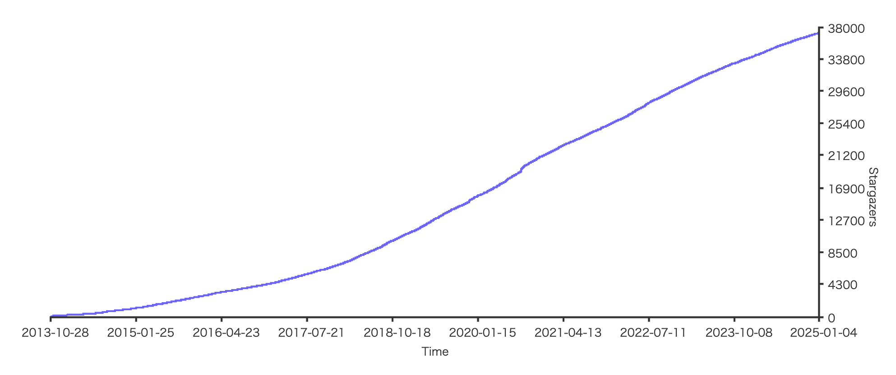
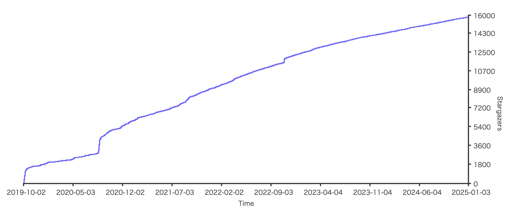
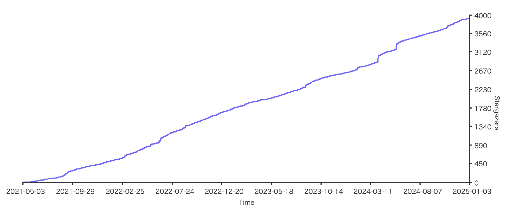
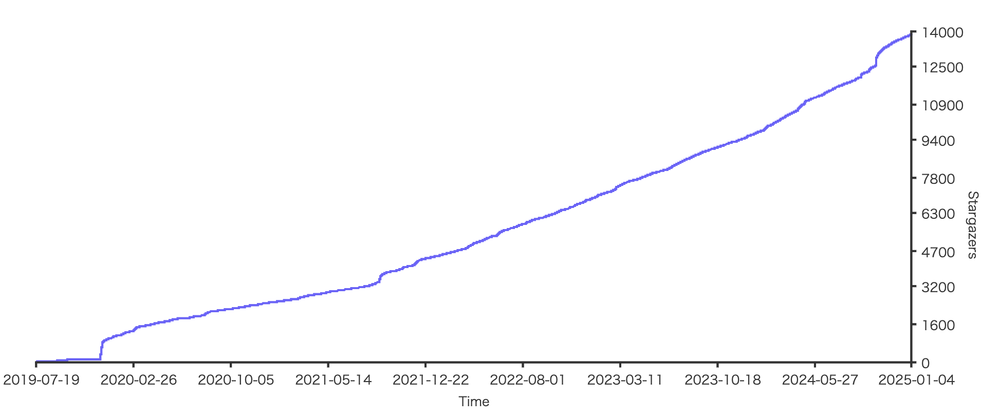

# O/Rマッパー

## 調査時期

2025/1/2 now

## 前提

- GitサーバはGitHubのみ。
- 以下のデータベースに対応していること。
  - MySQL
  - PostgreSQL

## 定量的な比較表

`Star`および`Watch`はGitHub上のもの。

| 名称<br>(リンク)                                                                | 最終<br>更新日  | Star  | Watch | 最新<br>Version | License      | 開発元                        | ドキュメント                                |
|----------------------------------------------------------------------------|------------|-------|-------|---------------|--------------|----------------------------|---------------------------------------|  
| [GORM](https://github.com/go-gorm/gorm)                                    | 2024-12-06 | 37.2k | 495   | v1.25.12      | MIT          | ？                        | https://gorm.io/ja_JP/docs/index.html |
| [ent](https://github.com/ent/ent)                                          | 2024-12-31 | 15.8k | 154   | v0.14.1       | Apache-2.0   | Meta社                      | https://entgo.io/ja/                  |
| ~~[SQL Boiler](https://github.com/volatiletech/sqlboiler)~~<br>メンテナンスモード   | 2024-12-11 | 6.8k  | 77    | v4.17.1       | BSD-3-Clause | Volatile Technologies Inc. | -                                     |
| [Bun](https://github.com/uptrace/bun)                                      | 2025-01-01 | 3.9k  | 28    | v1.2.7        | BSD-2-Clause | ？                          | https://bun.uptrace.dev/              |
| ~~[xorm](https://github.com/go-xorm/xorm?tab=readme-ov-file)~~<br>Giteaに移行 | 2019-10-15 | 6.7k  | 265   | v0.5.6        | BSD-3-Clause | ？                          | https://xorm.io/                      |
| [sqlc](https://github.com/sqlc-dev/sqlc)                                   | 2024-12-28 | 13.9k | 82    | v1.27.0       | MIT          | ？                          | https://sqlc.dev/                     |

### GitHub Star History

[startchart.cc](https://starchart.cc/)を使用。

#### GORM


#### ent


#### Bun


#### sqlc


## 定性的な比較表

| 観点                   | GORM                                                         | ent                                                                                     | Bun                                                                                   | sqlc                                                                                          |
|:----------------------:|:------------------------------------------------------------:|:---------------------------------------------------------------------------------------:|:--------------------------------------------------------------------------------------:|:----------------------------------------------------------------------------------------------:|
| **人気度／コミュニティ** | - 利用者多数・情報豊富<br>- Starsや記事が多く導入事例豊富        | - 新興だがFacebook(現Meta)製で注目度高<br>- 活発な開発と徐々に増える利用者                 | - もともとgo-pgフォーク<br>- 新しめだが利用者増加中                                     | - 大手企業を含む導入例あり<br>- そこまで大規模コミュニティではないが、着実に勢いがある           |
| **学習コスト**          | - 低〜中<br>- シンプルに導入しやすい<br>- ドキュメントや記事が豊富 | - 中<br>- スキーマ定義やコード生成の概念を理解する必要<br>- 型安全性を活かすには習熟度必要   | - 中<br>- 構造体タグやクエリビルダを理解<br>- ドキュメントは整備されつつある             | - 中<br>- 生SQLを直接書くためSQLの知識が必要<br>- 設定ファイル・コード生成フローを理解する必要    |
| **パフォーマンス考慮**  | - 機能豊富ゆえ抽象化オーバーヘッドあり<br>- 一般的なWebアプリなら十分 | - 中〜高<br>- 生成コードは効率的だが、複雑なロジックは検討必要                              | - 中<br>- 抽象化はあるが比較的軽量<br>- 直書きSQLも混在させやすい                         | - 高<br>- ほぼ生のSQL同等の実行効率<br>- ORMレイヤーのオーバーヘッドほぼなし                     |
| **型安全性**            | - △（動的API中心）<br>- コンパイル時に検知しづらい                 | - ◎（宣言的スキーマ → 自動生成コード）<br>- ミスがコンパイルエラーでわかりやすい            | - △（動的API + 構造体タグでのマッピング）<br>- entほど強い型安全はない                     | - ◎（SQL → Go構造体自動生成）<br>- SQLとの整合性をコンパイル時にチェック可能                  |
| **柔軟なクエリ構築**     | - ◎（豊富なメソッドチェーン・Association等）<br>- 直書きSQLも一応可能 | - ◎（リレーション管理が強力）<br>- メソッドチェーン・GraphQL的な使い方                     | - ◎（ORMとしてのマッピング + SQLビルダ）<br>- 生SQLも書ける柔軟性                         | - ◎（SQLをそのまま記述）<br>- ORMの制約がなく最高度に自由                                      |
| **コード生成機能有無**  | - ×（モデルやクエリは手書き）                                     | - ◎（entコマンドによりGoコードを自動生成）                                                | - ×（モデルは手書き／タグでマッピング）                                                   | - ◎（SQLファイルから構造体やメソッドを自動生成）                                              |
| **マイグレーション機能有無** | - ◎（AutoMigrateなど標準機能あり）                               | - ◎（ent migration機能あり）                                                            | - ◎（bun migrationコマンドあり）                                                          | - ×（標準はなし、外部ツールか手動で対応）                                                     |
| **ユースケース**         | - **初学者や比較的シンプルなプロジェクト**<br>- ドキュメント・日本語記事が多く導入障壁低い | - **複雑なリレーション・型安全性重視**<br>- スキーマとコードの整合性を強く保ちたい場合       | - **MySQL/Postgres/SQLiteなどを横断的に**<br>- ほどほどに軽量＆柔軟なORMが欲しい場合         | - **SQLを直接制御してパフォーマンス重視**<br>- ORMを使わずに型安全を担保したい場合               |

## 触ってみた上での所感
### GORM

#### コード例
```
db.Create(&u)
db.Preload("Posts.Comments").Find(&allUsersWithPostsWithComments)
```

- O/Rマッパー慣れしてる人なら使いやすい。
- Goユーザーの経験率が高そうという意味でも敷居が低い。
- Relation関係など、実際に発行されるSQLはちゃんと確認した方がよい。

何も考えずに使えるがちゃんと調べないと、[こういうこと](https://scrapbox.io/keroxp/Gorm%E3%81%8C%E6%9C%AC%E7%95%AA%E3%83%86%E3%83%BC%E3%83%96%E3%83%AB%E3%81%AE%E6%95%B0%E5%84%84%E4%BB%B6%E3%81%AE%E3%83%87%E3%83%BC%E3%82%BF%E3%82%92%E6%B6%88%E3%81%9D%E3%81%86%E3%81%A8%E3%81%97%E3%81%9F%E8%A9%B1)が起きそうになることもある。

### ent

#### コード例
```
client.User.Create().SetName("Alice").Save(ctx)
client.User.Query().WithPosts().WithComments().All(ctx)
```

- Relation関係の初期理解コストが高い。

### bun

#### コード例
```
db.NewInsert().Model(u).Exec(ctx)
db.NewSelect().Model(&allUsersWithPostsWithComments).Relation("Posts").Scan(ctx)
```

- GORMと同じくO/Rマッパー慣れしてる人なら使いやすい。
- GORMではなくbunを選ぶ決定的な理由が見当たらない。

### sqlc

#### コード例
```
db.Create(&u)
q.ListUserWithPostAndComments(ctx)
```

- 目的のSQLにするためのO/Rマッパー構文を覚えなくていいのは楽。
- O/Rマッピングは自分で実装する必要があるため、階層構造を持つケースが多いと面倒かも。
- `with`句や`max(id)`、副問い合わせ等のSQLも対応している。
- 別途マイグレーション機能を導入する場合、都度、最新のDDLを `schema.sql` に反映する必要がありそう。
